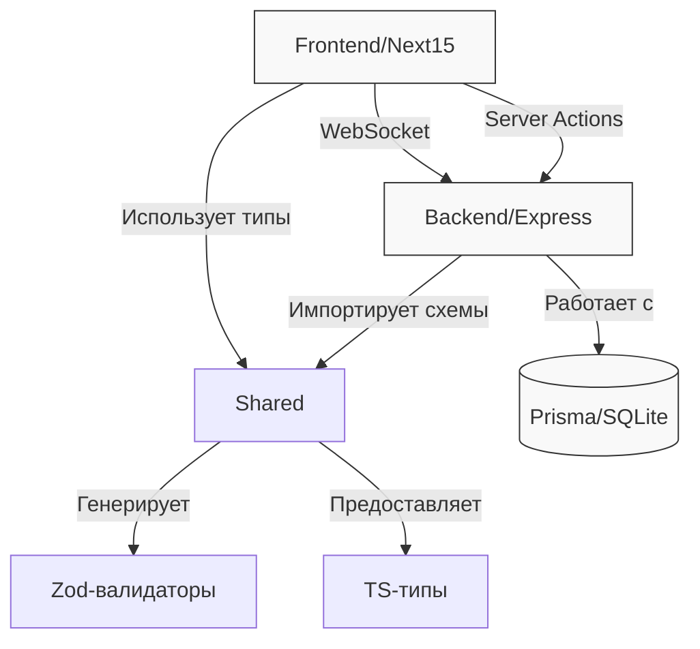

# Архитектура монорепозитория чат-приложения

## Задача
Создать шаблон full-stack приложения с:
- **Единой типизацией** - общие типы данных между фронтендом и бэкендом
- **Минимальным бойлерплейтом** - только необходимый функционал для быстрого старта
- **Автоматизированными процессами** - линтинг, сборка, деплой "из коробки"
- **Масштабируемостью** - четкое разделение модулей для последующего расширения

## Основные принципы архитектуры
1. **Type-First подход**:
   - Все сущности сначала описываются типами TypeScript
   - Генерация документации и валидаторов из типов (Zod)
   - Сквозная типобезопасность от БД до UI

2. **Монорепозиторий**:
   - `frontend` - Next.js 15 с Server Components
   - `backend` - Express + Prisma ORM
   - `shared` - общие типы, валидаторы, DTO

3. **Автоматизация**:
   - Хуки Git для проверки типов и линтинга
   - Параллельный запуск сервисов через `pnpm run dev`
   - Оптимизированные Docker-сборки с кешированием

## Взаимодействие компонентов

**Пояснения:**
1. **Shared-модуль** - центральное звено для:
   - Общих типов (TypeScript interfaces)
   - Валидационных схем (Zod)
   - DTO для API-коммуникации

2. **Связь фронтенд-бэкенд**:
   - REST API для CRUD операций
   - WebSocket для real-time обновлений чата
   - Server Actions для прямого вызова бэкенд-методов

3. **Работа с данными**:
   - Prisma Client для типобезопасных запросов
   - SQLite для разработки (легковесная БД)
   - Миграции через Prisma Migrate

## Структура проекта с пояснениями
```
monorepo-chat/
├── packages/
│   ├── frontend/    # Клиентская часть
│   │   ├── src/app/         # App Router Next.js
│   │   │   ├── chat/[id]/   # Динамические роуты чат-комнат
│   │   │   │   └── page.tsx # Страница чата (Server Component)
│   │   └── lib/            # Вспомогательные модули
│   │       ├── socket.ts   # WebSocket-клиент
│   │       └── api.ts      # Обертка над fetch с валидацией
│   │
│   ├── backend/     # Серверная часть
│   │   ├── prisma/         # ORM конфигурация
│   │   │   ├── schema.prisma  # Модели БД
│   │   │   └── migrations/    # История миграций
│   │   └── src/
│   │       ├── index.ts       # Запуск сервера
│   │       └── routes/        # Маршруты Express
│   │           └── chat.ts    # API для работы с чатом
│   │
│   └── shared/      # Общие модули
│       └── src/
│           ├── index.ts         # Экспорт всех сущностей
│           ├── types/           # TS-типы
│           │   └── chat.ts      # Типы сообщений, комнат
│           └── validators/      # Zod-схемы
│               └── chat.ts      # Валидация входящих данных
│
└── Dockerfile      # Продакшен-сборка с multi-stage
                    # 1. Билд фронтенда
                    # 2. Подготовка бэкенда
                    # 3. Запуск Nginx
```
**Ключевые особенности:**
1. **Изоляция модулей** - каждый сервис в отдельной директории
2. **Строгая типизация** - типы определены один раз в shared
3. **Готовые решения**:
   - Реализация чат-комнат "из коробки"
   - Настроенный WebSocket
   - Примеры API-запросов с валидацией

## Ключевые зависимости
| Категория       | Библиотеки                  |
|-----------------|-----------------------------|
| Валидация       | Zod                         |
| Стили           | Tailwind                    |
| ORM             | Prisma с SQLite адаптером  |
| Взаимодействие  | WebSockets (socket.io)      |
| Линтинг         | ESLint + TypeScript Plugin  |
| Инфраструктура  | pnpm workspaces             |

## Инфраструктура и автоматизация

### 1. Автоматизация процессов
```bash
# Запуск всего проекта одной командой
pnpm run dev
  → frontend (Next.js)
  → backend (Express)
  → Prisma Studio (просмотр БД)

# Пре-коммит хуки (husky)
pre-commit: 
  → Проверка типов (tsc)
  → Линтинг (ESLint)
  → Форматирование (Prettier)

# Сборка для production
pnpm build
  → Next.js static export
  → Prisma client generation
  → Docker image build
```

### 2. Конфигурация проекта
**TypeScript**:
- Единый `tsconfig.base.json` с общими настройками
- `composite: true` для инкрементальной сборки
- Пути для импортов (`@shared/*`)

**Линтинг**:
- Единые правила ESLint для всего монорепозитория
- Строгие правила TypeScript (`strict: true`)
- Автофикс на сохранение файла (VSCode)

**Изоляция**:
- Отдельные `.env` файлы для каждого сервиса
- Запрет на импорты между frontend/backend
- Четкие границы модулей через `internal.ts`

## Начало работы

### Инициализация и настройка
```bash
# Создать монорепозиторий и установить зависимости
mkdir monorepo-chat && cd monorepo-chat
pnpm init
pnpm add -D typescript @types/node husky
npx tsc --init
```

**Базовая конфигурация**:
```yaml
# pnpm-workspace.yaml
packages:
  - 'packages/*'
```

```json
// tsconfig.base.json
{
  "compilerOptions": {
    "target": "ES2022",
    "module": "NodeNext",
    "moduleResolution": "NodeNext",
    "strict": true,
    "composite": true,
    "paths": {
      "@shared/*": ["./packages/shared/src/*"]
    },
    "baseUrl": "."
  },
  "exclude": ["node_modules"]
}
```

**Важно**: Каждый подпакет расширяет базовую конфигурацию через `extends: "../../tsconfig.base.json"`

3. Shared-модули:
```bash
mkdir -p packages/shared/src
cd packages/shared && pnpm init
pnpm add zod
```


4. Бэкенд-сервис:
```bash
cd packages/backend
pnpm init
pnpm add express @prisma/client
pnpm add -D prisma @types/express

npx prisma init --datasource-provider sqlite
```

5. Фронтенд-приложение (Next15):
```bash
cd packages/frontend
pnpm create next-app@latest . --ts --tailwind --eslint
pnpm add @radix-ui/react-dropdown-menu @hookform/resolvers
```

6. Интеграция shared-модулей:

**Шаги:**
1. Добавить paths в корневой tsconfig.json:
```json
{
  "compilerOptions": {
    "paths": {
      "@shared/*": ["./packages/shared/src/*"]
    }
  }
}
```

2. Установить shared-пакет:
```bash
pnpm add @shared@workspace:*
```

**Важно:** Без настройки paths TypeScript не сможет разрешить импорты из shared-модулей
```json
{
  "compilerOptions": {
    "paths": {
      "@shared/*": ["./packages/shared/src/*"]
    }
  }
}
```

## Оптимизации
- Единая точка входа для типов: `shared/src/index.ts`
- Автоматическая генерация Prisma-клиента
- Кеширование Docker-слоев

1. **Сквозная типовая безопасность:**
```typescript
// shared/src/chat-types.ts
export type Message = {
  id: string;
  content: string;
  createdAt: Date;
};

// frontend: import { Message } from '@shared/chat-types';
// backend: import { Message } from '@shared/chat-types';
```

2. **Docker-оптимизации:**
```dockerfile
# Кеширование зависимостей
COPY package.json pnpm-lock.yaml ./
RUN pnpm fetch && pnpm install -r --offline
```

3. **Линтинг shared-модулей:**
```javascript
// packages/shared/.eslintrc.js
module.exports = {
  extends: ['../../.eslintrc.js'],
  rules: {
    'no-console': 'error'
  }
};
```

## Рекомендации по разработке

### Инструменты разработчика
1. **Расширения VSCode**:
   - Prisma - подсветка схем БД
   - ESLint - инлайн-подсветка ошибок
   - Tailwind CSS IntelliSense - автодополнение классов
   - Thunder Client - тестирование API

## 1. Инициализация проекта
```bash
mkdir monorepo-chat && cd monorepo-chat
pnpm init
pnpm add -D typescript @types/node
```

## 2. Настройка монорепозитория
1. Создать `pnpm-workspace.yaml`:
```yaml
packages:
  - 'packages/*'
```

2. Общая конфигурация TypeScript (`tsconfig.json`):
```json
{
  "compilerOptions": {
    "target": "ES2020",
    "module": "NodeNext",
    "strict": true,
    "esModuleInterop": true,
    "skipLibCheck": true,
    "forceConsistentCasingInFileNames": true
  }
}
```

3. Добавить скрипты в корневой `package.json`:
```json
{
  "scripts": {
    "dev": "pnpm run --parallel dev",
    "dev:frontend": "cd packages/frontend && pnpm dev",
    "dev:backend": "cd packages/backend && pnpm dev"
  }
}
```

## 3. Shared package
```bash
mkdir -p packages/shared/src
cd packages/shared && pnpm init
```

`packages/shared/package.json`:
```json
{
  "name": "shared",
  "main": "./dist/index.js",
  "types": "./dist/index.d.ts",
  "dependencies": {
    "zod": "^4.0.5"
  }
}
```

## 4. Backend (Express + Prisma)
```bash
mkdir -p packages/backend/src
cd packages/backend && pnpm init
pnpm add express @prisma/client
pnpm add -D prisma typescript @types/express
```

Настройка Prisma:
```bash
npx prisma init
```

Пример схемы (`schema.prisma`):
```prisma
generator client {
  provider = "prisma-client-js"
}

datasource db {
  provider = "sqlite"
  url      = "file:./dev.db"
}
```

## 5. Frontend (Next.js 14)
```bash
mkdir -p packages/frontend
cd packages/frontend 
pnpm create next-app .
```

Конфигурация Tailwind:
```bash
npx tailwindcss init -p
```
## 6. Деплой
```dockerfile
# Продакшен-сборка
FROM node:20-alpine as builder
WORK /app
COPY . .
RUN pnpm install && pnpm build

# Финальный образ
FROM node:20-alpine
COPY --from=builder /app .
CMD ["pnpm", "start"]
```

**Настройка окружения**:
```bash
# Создать .env файл для production
echo "DATABASE_URL=file:./prod.db\nNODE_ENV=production" > .env
```

## Рекомендуемые расширения VSCode
- Prisma
- ESLint
- Tailwind CSS IntelliSense
- Turbo Console
